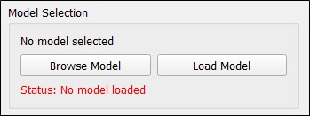
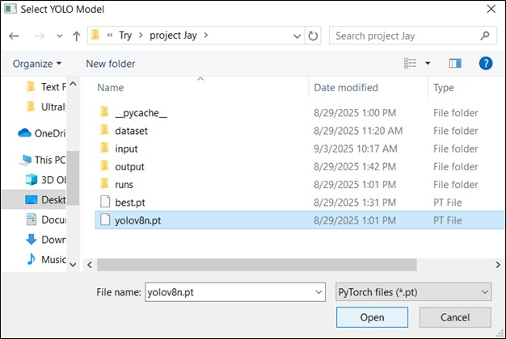
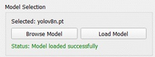
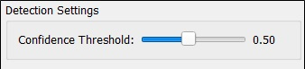
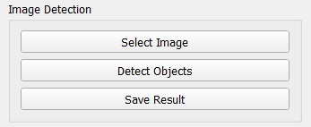
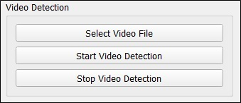
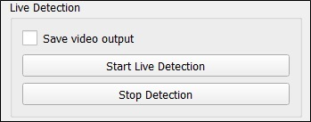

# YOLO Object Detection GUI
This is a desktop application for real-time object detection using the YOLO (You Only Look Once) model build with ultralytics libarary. It's built with PyQt5 for the graphical user interface and OpenCV for video and image processing. The application allows users to load a YOLO model, adjust detection settings, and perform object detection on images, video files, or a live webcam feed.

## Features ✨
- **Model Loading:** Load a pre-trained YOLO model (e.g., a .pt file).

- **Confidence Threshold:** Adjust the confidence slider to filter detection results based on a minimum confidence score.

- **Image Detection:** Select an image file, detect objects, and save the resulting annotated image.

- **Video Detection:** Select a video file to perform object detection frame-by-frame. The annotated video can be saved to a new file.

- **Live Webcam Detection:** Connect to your default webcam to perform real-time object detection. The live feed can also be recorded and saved.

- **Real-time Statistics:** View live statistics, including frame count, detection count, and estimated frames per second (FPS).

- **Multi-threading:** The video processing and detection are handled in a separate thread to prevent the GUI from freezing. This ensures a smooth and responsive user experience.

## Prerequisites 🛠️
Before running the application, make sure you have the following libraries installed:

- **Python 3.x**

- **PyQt5:** For the GUI.

- **OpenCV:** For image and video handling.

- **Ultralytics:** The library that provides the YOLO models and their functionality.

- **NumPy:** A fundamental package for scientific computing in Python.


# How to use 

### Install all the required libraries using pip:
- Install required libararies.
    ```Bash
    pip install -r requirements.txt
    ```

- **Download a YOLO Model:** The application requires a YOLO model file. You can download pre-trained weights from the Ultralytics GitHub repository. For example, download yolov8n.pt and place it in the same directory as the script.

- **Run the Script:** Open a terminal or command prompt, navigate to the directory where you saved the file, and run the script:

    ```Bash
    python main.py
    ```

## User Guide 🚀
### Load a Model:

- Click the "Browse Model" button to select your YOLO model file (e.g., yolov8n.pt).

    
    
- Click "Load Model" to load the model into the application. The status label will turn green if successful.

    

### Adjust Confidence:

Use the **"Confidence Threshold"** slider to set the minimum confidence score for a detection to be displayed. Detections below this threshold will be ignored.
    

### Perform Detection:

- **Image:** Click "Select Image" to choose an image file. Once loaded, click "Detect Objects" to see the results. Use "Save Result" to save the annotated image.


- **Video:** Click "Select Video File" to choose a video. Then, click "Start Video Detection" to begin processing. The annotated video will be saved to a new file in the same directory.

    

- **Live Webcam:** Check the "Save video output" box if you want to record the live session. Click "Start Live Detection" to activate your webcam. Click "Stop Detection" to end the session.
    

## Code Structure 📂
- **VideoThread Class:** A QThread subclass that handles all the heavy lifting of video capture and object detection. It runs in a separate thread to keep the GUI responsive.

- **YOLODetectionGUI Class:** The main QMainWindow class that sets up the entire graphical user interface, including all buttons, labels, and layouts. It connects user actions to the backend detection logic.

- **main() Function:** The entry point of the application, which creates and runs the QApplication and the main window.


## Disclaimer:
I use QT and ultralytics library both have commericial license as well. So verify first befor commerical use. 


---
- **Author :** kuldeepshergill@outlook.com
- **License :** GPL 
- **Suggestion :** Feel free to contribute or suggestions.  